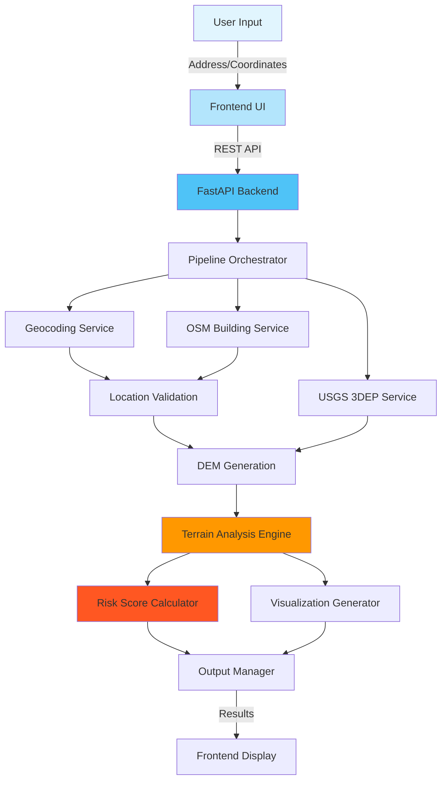

# Flood Risk Rating of Properties: Terrain Analysis Pipeline

[](https://www.python.org/)
[](https://fastapi.tiangolo.com/)
[](LICENSE)
[](https://www.uchicago.edu/)

## Overview

Property-scale flood risk is driven by **micro-topography** — tiny elevation differences that determine whether water drains away from a property or pools around it. Traditional tools (FEMA maps, coarse DEMs, zonal statistics) often miss these fine-scale patterns and cannot reliably distinguish a safe house on a ridge from a vulnerable house in a shallow bowl within the same flood zone.

This repository implements a **LiDAR-based geospatial analysis pipeline** that provides:

- **1-meter resolution** bare-earth Digital Elevation Models (DEMs) from USGS 3DEP data
- **Physics-based terrain risk scoring** (0–1 scale) reflecting drainage patterns
- **Multi-scale analysis** from 10m to 500m radius around properties
- **Interactive web dashboard** for underwriting and risk analytics
- **Interpretable metrics** complementing existing FEMA zones and proprietary models

### Academic Partnership

This project is a collaboration between:
- **Tokio Marine Highland (TMH)** - Industry partner providing domain expertise
- **University of Chicago** - MS in Applied Data Science Capstone Project

---

## Key Features

### **Automated DEM Generation**
- 1m bare-earth DTM from LiDAR point clouds (USGS 3DEP)
- PDAL-based pipeline for noise filtering and ground classification
- Automatic dataset discovery and download

### **Building-Aware Property Localization**
- Dual-source geocoding (Google Maps / Nominatim)
- OpenStreetMap building footprint integration
- Smart relocation to actual building locations

### **Advanced Terrain Analytics**
- **Adaptive house-ground estimation** using concentric rings (3-30m)
- **IQR-based outlier removal** with skew-aware quantiles
- **Multi-scale ring analysis** (10-500m radius)
  - Relative elevation (Δelevation)
  - Slope statistics and terrain classification
  - Flow convergence and dominant drainage directions

### **Composite Risk Scoring**
- Global elevation ranking (500m context)
- Local depression analysis
- Flatness assessment (drainage speed)
- Flow convergence quantification
- Transparent weighting with gamma non-linearity

### **Rich Visualization Suite**
- 2D elevation, slope, and aspect maps
- Histogram-based elevation distributions
- Interactive 3D terrain views (dual AOI comparison)
- Multi-scale metrics tables
- Natural language narrative reports

### **Modern Web Architecture**
- **FastAPI** backend with async support
- **RESTful API** for pipeline orchestration
- **Responsive UI** with Tailwind CSS
- **Interactive maps** using Leaflet.js
- **Real-time charts** with Chart.js

---

## 🏗️ System Architecture



---

## Installation

### Prerequisites

#### System Requirements
- **Python 3.10+** (3.11 or 3.12 recommended)
- **8GB RAM** minimum (16GB recommended for large DEMs)
- **10GB disk space** for DEM cache and outputs

#### Required System Libraries

**macOS (using Homebrew):**
```bash
brew install gdal proj geos pdal
```

**Ubuntu/Debian:**
```bash
sudo apt-get update
sudo apt-get install gdal-bin libgdal-dev python3-gdal pdal
```

**Windows:**
- Install [OSGeo4W](https://trac.osgeo.org/osgeo4w/) for GDAL/PROJ/GEOS
- Install [PDAL](https://pdal.io/en/latest/download.html) separately

### 🚀 Quick Installation

1. **Clone the repository:**
```bash
git clone https://github.com/Ronniiie02/Terrain-analysis.git
cd Terrain-analysis
```

2. **Create virtual environment:**
```bash
python -m venv .venv
source .venv/bin/activate  # On Windows: .venv\Scripts\activate
```

3. **Install dependencies:**
```bash
pip install -e .
```

4. **Set up environment variables:**
```bash
cp .env.example .env
# Edit .env with your API keys:
# - GOOGLE_MAPS_API_KEY (optional, for geocoding)
# - Add any other configuration
```

---

## 🚀 Quick Start

### 1. Start the Backend Server

```bash
# From project root
uvicorn api.app:app --reload --host 127.0.0.1 --port 8000
```

The API will be available at:
- Base URL: `http://127.0.0.1:8000`
- Interactive docs: `http://127.0.0.1:8000/docs`
- Alternative docs: `http://127.0.0.1:8000/redoc`

### 2. Launch the Frontend UI

```bash
# From project root
cd frontend
python -m http.server 5173
```

Access the UI at: `http://127.0.0.1:5173/index.html`

### 3. Run Your First Analysis

**Via UI:**
1. Enter an address or coordinates
2. Select analysis radius (default 500m)
3. Click "Analyze"
4. View results in real-time

**Via Python:**
```python
from elevation.run_final_pipeline import PipelineConfig, run_pipeline

# Configure the analysis
config = PipelineConfig()
config.lat = XXX  # Coordinates
config.lon = XXX
config.aoi_radius_m = 500.0
config.output_dir = "./outputs/my_analysis"
config.generate_narrative = True
config.save_3d = True

# Run the pipeline
results = run_pipeline(config)

# Access results
print(f"House elevation: {results['house_ground_m']} m")
print(f"Percentile rank: {results['percentile_rank']}%")
print(f"Terrain risk score: {results['terrain_risk_score']}")
print(f"Outputs saved to: {results['outputs_dir']}")
```

---

## API Documentation

### Core Endpoints

#### `POST /runs`
Trigger a new terrain analysis run.

**Request Body:**
```json
{
  "address": "XXX",
  "lat": null,
  "lon": null,
  "aoi_radius_m": 500,
  "output_format": "both"
}
```

**Response:**
```json
{
  "run_id": "XXX",
  "status": "processing",
  "message": "Pipeline started successfully"
}
```

#### `GET /runs/{run_id}`
Retrieve results for a specific run.

**Response:**
```json
{
  "run_id": "XXX",
  "status": "completed",
  "house_ground_m": XXX,
  "percentile_rank": XXX,
  "terrain_risk_score": XXX,
  "risk_percentile": XXX,
  "manifest_path": "/outputs/XXX/manifest.json"
}
```

#### `GET /runs/{run_id}/manifest`
Get the complete manifest with all output paths.

---

## Core Pipeline Workflow

### 1. **Location Resolution** 
- Address geocoding via Google Maps or Nominatim
- Coordinate validation and projection handling
- Fallback strategies for ambiguous locations

### 2. **Building Detection** 
- OSM Overpass API query for building footprints
- Spatial intersection and proximity analysis
- Smart relocation to building centroid
- Fallback circular building generation

### 3. **DEM Generation** 
- USGS 3DEP dataset discovery
- LiDAR point cloud download and processing
- PDAL pipeline execution:
  ```json
  {
    "pipeline": [
      "input.las",
      {
        "type": "filters.outlier",
        "method": "statistical",
        "multiplier": 3.0
      },
      {
        "type": "filters.smrf",
        "ignore": "Classification[7:7]"
      },
      {
        "type": "writers.gdal",
        "resolution": 1.0,
        "output_type": "mean"
      }
    ]
  }
  ```

### 4. **Terrain Analysis** 
- **Slope calculation:** First derivative of elevation
- **Aspect computation:** Direction of maximum slope
- **Curvature analysis:** Second derivative metrics
- **Flow accumulation:** D8 algorithm for drainage paths

### 5. **Multi-Scale Metrics** 
For radii [10, 50, 100, 200, 300, 500] meters:
- Δelevation (house vs. ring median)
- Slope statistics (min, max, mean, std)
- Terrain classification percentages
- Flow convergence index
- Dominant drainage direction

### 6. **Risk Score Calculation** 
Terrain-based flood susceptibility is computed from four core components:
Global elevation risk — how low a pixel sits relative to the 500 m elevation distribution
Depressional depth — degree to which the surface lies below the neighborhood median
Flatness risk — flatter terrain is more prone to water pooling
Directional exposure — orientation effects derived from aspect (sin/cos)

```python
# Composite risk formula
risk = w1 * global_elevation_risk \
     + w2 * depression_risk \
     + w3 * flatness_risk \
     + w4 * directional_exposure_risk

A gamma transformation amplifies risk for extremely low-lying elevations:
global_score = (1 - elevation_percentile) ** gamma
```

### 7. **Output Generation** 
- High-resolution PNG maps
- Interactive 3D HTML visualizations
- Data tables
- Natural language narrative
- JSON manifest file

---

## 📊 Output Interpretation

### Key Metrics Explained

| Metric | Description | Interpretation |
|--------|-------------|----------------|
| **house_ground_m** | Robust ground elevation at building | Absolute elevation in meters |
| **percentile_rank** | % of surrounding terrain lower than house | <20%: Low-lying, >80%: Elevated |
| **ΔElev_median** | House elevation vs. ring median | Negative: Depression, Positive: Ridge |
| **terrain_risk_score** | Composite drainage risk (0-1) | 0: Best drainage, 1: Worst drainage |
| **flow_convergence** | Water accumulation index | >1: Flow concentrates here |

### Risk Score Interpretation

| Score Range | Risk Level | Description |
|------------|------------|-------------|
| 0.0 - 0.2 | **Very Low** | Excellent drainage, elevated position |
| 0.2 - 0.4 | **Low** | Good drainage, minimal concerns |
| 0.4 - 0.6 | **Moderate** | Average drainage, some pooling possible |
| 0.6 - 0.8 | **High** | Poor drainage, significant pooling likely |
| 0.8 - 1.0 | **Very High** | Severe drainage issues, depression |

---

## 📂 Project Structure

```
Uchicago-elevation/
│
├── 📁 api/                      # Backend API
│   ├── app.py                   # FastAPI application
│   ├── routers/                 # API endpoints
│   │   └── runs.py              # Pipeline execution routes
│   ├── schemas.py               # Pydantic models
│   ├── services/                # Business logic
│   │   ├── pipeline_runner.py   # Orchestration service
│   │   └── cache.py             # Caching utilities
│   └── settings.py              # Configuration
│
├── 📁 frontend/                 # Web UI
│   ├── index.html               # Main application
│   ├── css/                     # Stylesheets
│   │   ├── styles.css           # Custom styles
│   │   └── utilities.css        # Utility classes
│   └── js/                      # JavaScript modules
│       ├── api.js               # Backend communication
│       ├── main.js              # Application logic
│       ├── map.js               # Leaflet integration
│       └── ui.js                # UI components
│
├── 📁 src/elevation/            # Core library
│   ├── analytics.py             # Statistical analysis
│   ├── config.py                # Configuration
│   ├── dem.py                   # DEM generation
│   ├── geocode.py               # Geocoding services
│   ├── helpers.py               # Utilities
│   ├── osm.py                   # OSM integration
│   ├── run_final_pipeline.py    # Main pipeline
│   ├── terrain.py               # Terrain analysis
│   └── viz.py                   # Visualization
│
├── 📁 outputs/                  # Results directory
│   └── <run_id>/                # Per-run outputs
│       ├── figures/             # Maps and charts
│       ├── data/                # Tables and metrics
│       └── manifest.json        # Run metadata
│
├── 📁 tests/                    # Test suite
│   ├── unit/                    # Unit tests
│   ├── integration/             # Integration tests
│   └── scripts/                 # Test utilities
│
├── 📄 pyproject.toml            # Project dependencies
├── 📄 README.md                 # Documentation
├── 📄 LICENSE                   # License file
└── 📄 .env.example              # Environment template
```

---

## Technologies Used

### Backend
- **Python 3.10+** - Core programming language
- **FastAPI** - Modern async web framework
- **Pydantic** - Data validation and settings
- **GDAL/OGR** - Geospatial data processing
- **PDAL** - Point cloud data processing
- **Rasterio** - Raster I/O operations
- **GeoPandas** - Spatial dataframes
- **Shapely** - Geometric operations
- **NumPy/SciPy** - Numerical computing
- **Pandas** - Data manipulation
- **Plotly** - 3D visualizations

### Frontend
- **HTML5/CSS3** - Structure and styling
- **Tailwind CSS** - Utility-first CSS framework
- **JavaScript (ES6+)** - Client-side logic
- **Leaflet.js** - Interactive maps
- **Chart.js** - Data visualization
- **Three.js** - 3D terrain rendering

### Data Sources
- **USGS 3DEP** - LiDAR elevation data
- **OpenStreetMap** - Building footprints
- **Google Maps API** - Geocoding (optional)
- **Nominatim** - Open-source geocoding

---

## ⚠️ Limitations & Scope

### What This Tool **DOES**
✅ High-resolution terrain-based flood susceptibility analysis  
✅ Physics-based drainage pattern assessment  
✅ Property-specific micro-topography insights  
✅ Transparent, interpretable risk metrics  
✅ Complementary layer to existing flood models  

### What This Tool **DOES NOT**
❌ Predict actual flood depths or velocities  
❌ Calculate insurance premiums or claim probabilities  
❌ Account for rainfall intensity or storm surge  
❌ Consider infrastructure (sewers, levees, pumps)  
❌ Replace FEMA maps or engineering studies  

### Important Considerations
- Results are relative to local terrain context
- Quality depends on LiDAR data availability and recency
- Urban areas may have modified drainage since DEM capture
- Building modifications not reflected in elevation data
- Best used as one input among multiple risk factors

---

## Academic Context

This repository implements methods from:

> **Flood Risk Rating of Properties: Leveraging Geospatial Analysis & Digital Elevation Models**  
> Yiyang Yao, Jialong Guo, Qi Yang, Chenxi Liu  
> *MS in Applied Data Science Capstone Project*  
> University of Chicago, November 2025

### Key Research Contributions
1. **Micro-topography focus:** Emphasis on property-scale elevation patterns
2. **Multi-scale analysis:** Hierarchical ring-based metric extraction
3. **Interpretable scoring:** Physics-based rather than black-box ML
4. **Operational pipeline:** Production-ready implementation with web UI


## Acknowledgments

We gratefully acknowledge:

- **[USGS 3D Elevation Program (3DEP)](https://www.usgs.gov/3d-elevation-program)** - High-quality LiDAR data
- **[OpenStreetMap Contributors](https://www.openstreetmap.org/)** - Building footprint data
- **[University of Chicago](https://www.uchicago.edu/)** - Academic support and resources
- **[Tokio Marine Highland](https://www.tokiomarinehighland.com/)** - Industry partnership and guidance

### Special Thanks
- The open-source geospatial community (GDAL, PDAL, OSGeo)
- FastAPI and Python scientific computing ecosystem
- All beta testers and early users who provided feedback

<div align="center">

*Advancing flood risk assessment through high-resolution terrain analysis*

</div>
